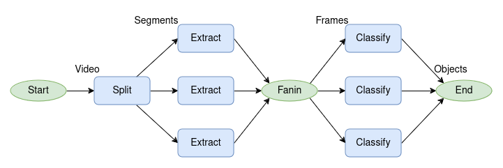

## Introduction

This is a sample Video Analytics application designed for deployment on AWS Lambda. The goal is to deploy a small set of functions, also known as a serverless workload or serverless DAG, on AWS Lambda. The code is adopted from [Orion](https://github.com/icanforce/Orion-OSDI22?tab=readme-ov-file#getting-started) and the following figure shows the architecture of the application.



## Setup and Execution

### Cone the Repository
First, clone the repository and navigate to the source directory:
```
git clone https://github.com/azamikram/video_analytics.git
cd video_analytics/src
```

### Configure AWS
Make sure that `aws` CLI is configured with your account. For detailed guide on how to setup an AWS account and configuring the AWS CLI, please refer to the [Orion setup guide](https://github.com/icanforce/Orion-OSDI22?tab=readme-ov-file#getting-started).

### Populate `params.py`
After configuring your AWS account, populate the `params.py` file. A sample file named `params.py.example` is provided. Rename this file to `params.py` and add the required parameters.

### Deploy the Application
Once everything is set up, deploy the application on AWS Lambda:

```
./deploy.sh
```

The `deploy.sh` script will:
- Deploy all functions to Lambda.
- Create a Step Function to execute the application.
- Upload a few sample videos to an S3 bucket.

### Execute the Application

Go to the AWS Management Console, navigate to Step Functions, and find the state machine named `video_sm`. You can use the following JSON to test an execution:

```json
{"src_name": 0, "bundle_size": 1, "detect_prob": 2}
```

The output of all functions will be uploaded to your S3 bucket. For the final output, check the `detecte-objects-repo` bucket.

### Gotchas
The classify function first creates a docker image and then deploys that image to AWS Lambda. You may need to modify `deploy_classify.sh` to use docker with `sudo` or [add your user to the docker group](https://stackoverflow.com/questions/48957195/how-to-fix-docker-got-permission-denied-issue).
